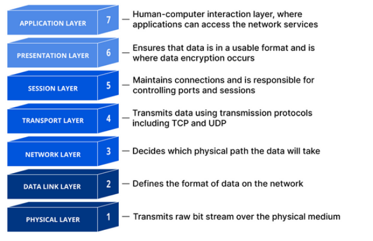

Güncel Ağ Güvenliği Sorunları ve Çözümleri

Gün geçtikçe artan siber saldırılar ve gelişen yeni siber saldırı yöntemleri, var olan güvenlik çözümlerini yetersiz bırakmakta, bu nedenle yeni çözümler sunma gerekliliğini sağlamaktadır. Örneğin bulut teknolojilerinin gelişmesiyle gelen yeni ihtiyaçlar, yeni tehditler doğurmaktadır.

Güncel saldırılara örnek olarak  DDoS’un yanında DDoS’un bir türü olan EDoS, DoS, Advanced Persistent Threat (APT), Cloud Jacking, Lateral Movement, Data Loss (Veri İhlali)’nden bahsedebiliriz. Şimdi ise bu saldırıların ne olduğuna, nasıl engellenebildiklerine bakalım.

DDoS
DDoS Nedir ve Gerçekleşir?
DDoS, uzun haliyle Distributed Denial Of Service saldırısı, en yaygın olarak bilinen ve yapılan saldırılardan biridir. Bu saldırı, internete bağlı bir barındırma hizmetinin hizmetlerini geçici veya süresiz olarak aksatarak bir makinenin veya ağ kaynaklarının asıl kullanıcılar tarafından ulaşılamamasını hedefleyen bir siber saldırıdır. Saldırgan, genelde botnet adı verilen içerisine zararlı bir yazılım yüklediği binlerce cihazdan bir sunucuya aynı anda bağlantı isteği atar. Bu kadar yüksek bağlantı isteği sonucunda sunucular bağlantı taleplerini karşılayamayacak hale gelir ve servis dışı kalır. Böylece sıradan kullanıcıların da DDoS saldırısı yapılan sunucudan servis alması engellenir. 

Bu saldırıda kullanılan botnetler, sıradan bilgisayarlar oluşabileceği gibi IoT cihazlarından da oluşabilir. Artık günümüzde sayısı hızla artan internete bağlı cihazlarımız sayesinde botnetler daha da güçlenmektedir. 

DDoS Saldırısı Nasıl Anlaşılır?
	Elbetteki bir DDoS saldırısının en belirgin belirtisi, bir sitenin veya hizmetin aniden yavaşlaması veya kullanılamaz hale gelmesidir. Ancak ders seçim zamanında okulun internet sitesinde yaşanan aşırı artış, YKS sınavının sonuçlarının açıklandığı gün ÖSYM’nin internet sitesi trafiğindeki aşırı artış gibi doğal sebeplerden dolayı da performans sorunları yaşanabilir. Bu nedenle, DDoS saldırısının olup olmadığını yalnızca trafik artışına bakarak anlayamayız. Bunun için trafik analiz araçlarını kullanarak daha da derine inmemiz DDoS saldırısı olduğu konusunda daha fazla işaret verebilir. 

Bu trafik analizinde dikkat edeceğimiz noktalara aşağıdaki gibi örnekler verebiliriz:
Tek bir IP adresinden veya IP aralığından (subnet) kaynaklanan şüpheli miktarda trafik akışı
Cihaz türü, coğrafi konum veya web tarayıcısı sürümü gibi tek bir davranış profilini paylaşan kullanıcılardan gelen trafik akışı 
Tek bir sayfaya veya endpoint’e yönelik isteklerde olağanüstü bir artış
Günün farklı saatlerinde ani artışlar veya doğal olmayan modeller (her 10 dakikada bir artış gibi)
Elbette ki DDoS saldırısı yalnızca bu belirtilere dayanmaz. DDoS saldırı stratejileri değiştikçe odaklanmamız gereken noktalar da değişebilir.

Yaygın Olan DDoS Saldırı Tipleri Nelerdir?
	İnternet teknolojisi, teknolojisi gereği katmanlı bir sistemden oluşur. Bu katmanlara OSI katmanı denir. OSI katmanı, eski zamanlarda 5 katmandan oluşsa da gelişen teknolojiler, güvenlik ihtiyaçları ile birlikte günümüzde 7 katmandan oluşur. DDoS saldırıları ise bu 7 katmandan herhangi birine yönelik olarak gerçekleşebilir. Bu katmanların nasıl oluştuğunu, ne işe yaradığını ise aşağıdaki görselden özetleyebiliriz:
	

Neredeyse tüm DDoS saldırıları, hedef cihazı veya ağı yoğun trafikle doldurmayı içerse de, saldırılar 3 kategoriye ayrılabilir. Saldırgan, hedefin aldığı karşı önlemlere yanıt olarak bir veya birden fazla saldırı vektörü kullanabilir veya saldırı vektörlerini döngüleyebilir.

Uygulama Katmanı Saldırıları

7. katman üzerinde yapılan bu saldırıların amacı, hizmet reddi oluşturmak için hedefin kaynaklarını tüketmektir.

Saldırılar, web sayfalarının sunucuda oluşturulduğu ve HTTP isteklerine yanıt olarak teslim edildiği katmanı hedef alır. Tek bir HTTP isteğinin istemci tarafında yürütülmesi maliyet açısından çok ucuzdur ancak sunucu genellikle birden fazla dosya yüklediğinden ve bir web sayfası oluşturmak için veritabanı sorguları çalıştırıldığından hedef sunucunun yanıt vermesi maliyeti olabilir. Eğer bu istek sayısı botnetler ile aşırı bir hızla artarsa sistemin çökmesine yol açabilir.

Ancak bu trafik artışı, yukarıda bahsettiğim YKS sınavının açıklandığı andaki ÖSYM sitesindeki trafik artışı gibi doğal sebeplerden de olabileceği için 7. katman saldırılarına karşı savunma yapmak zordur.

HTTP Flood
Bu saldırı, birçok bilgisayarda aynı anda bir web tarayıcısında yenileme tuşuna basmaya benzer, çok sayıda HTTP isteği sunucuya taşar ve hizmet reddine sebep olur. Bu tip saldırılar basitten karmaşığa doğru çeşitlilik gösterebilir.

Daha basit uygulamalar, aynı aralıktaki IP adresleri, yönlendirenleri ve cihazla URL’ye erişebilir. Ancak karmaşık olanları ise çok sayıda ve belirli bir aralıkta olmayan IP adresleri kullanabilir ve rastgele yönlendirme yöntemleri ile rastgele URL’leri hedefleyebilir.

Protokol Saldırıları
Protokol saldırıları, sunucu kaynaklarının ve/veya güvenlik duvarları ve yük dengeleyiciler gibi ağ ekipmanlarının kaynaklarının aşırı tüketilmesi ile hizmet kesintisi sağlamayı amaçlar. 

Bu saldırılar hedefi erişilemez kılmak için protokol yığınının 3. ve 4. katmanındaki zayıflıklarını kullanır.

SYN Flood
SYN Flood saldırısını anlamak için gündelik hayattan bir örnek verebiliriz. Mesela bir kahve dükkanı işlettiğinizi düşünün. Bu süreç genelde aşağıdaki gibi 3 adımda gerçekleşir:
Müşteri yanınıza gelir ve sizden istediği kahveyi talep eder.
Daha sonra siz de müşteriye kahveyi hazırlamaya başladığınızı söylersiniz ve beklemesini rica edersiniz.
Müşteri bekledikten sonra kahvesi hazır olur ve teslim edersiniz.

Şimdi ise kötü niyetli bir insanın geldiğini düşünün.
Kötü niyetli kişi, kahve dükkanınıza bir sürü insan gönderir (bu insanları saldırıları yapan botlar olarak hayal edebilirsiniz).
Kahve dükkanının sahibi olarak siz de herkese siparişin hazırlandığını iletip beklemelerini rica edersiniz.
Ancak dükkanınıza gelen sahte müşteriler siparişlerini asla onaylamazlar. Ya dükkanınızdan ayrılırlar ya da cevap vermeden orada dururlar.

TCP Handshake de bu şekilde çalışır. Normalde TCP Handshake protokolünün amacı veri kaybı olmadan veriyi iletebilmektir. Bu da yukarıdaki kahve dükkanı örneğinde olduğu gibi 3 aşamada gerçekleşir. İstemci sunucu ile bağlantı kurma isteği gönderir, sunucu isteği kabul eder ve istemciye kabul ettiğini söyleyen bir mesaj iletir, istemci de mesajı aldığını söyleyen bir mesaj iletir. Ancak SYN flood saldırılarında son adım gerçekleşmez. Sunucu istemciden sürekli mesajı aldığına dair bir onay mesajı bekler ancak o mesaj bir türlü gelmez. Bunun sonucunda da yarı açık bir bağlantı oluşur. Bu saldırıları çok kez tekrarlarsanız sunucu bir yerden sonra yarı açık kalan bağlantılar sebebiyle istekleri kaldıramaz hale gelir.

Hacimsel Saldırılar
Bu saldırının temel amacı hedeflenen sistemin veya ağın bant genişliğini aşmaktır. Uygulama katmanlarını hedef alabilen veya belirli güvenlik açıklarından yararlanabilen diğer saldırı türlerinden farklı olarak ağı büyük miktarda trafikle doyurmaya çalışır.
UDP Flood
Saldırgan, uzak bir ana bilgisayarın rastgele portlarına çok sayıda UDP paketi gönderir. Ana bilgisayar, bu portları dinleyen uygulamaları kontrol eder ve tabi ki bir uygulama bulamaz. Bunun sonucunda da ICMP Destination Unreachable paketi gönderir. Bu da sistemin kaynaklarını yorar.
ICMP Flood
Saldırganın yanıt beklemeden ping paketleri göndererek sistemi bunaltmasıdır. Kurbanın sunucuları sıklıkla ICMP Echo Reply paketleriyle yanıt vermeye çalışacağından, bu hem gelen hem de giden bant genişliğini tüketebilir.
Amplifikasyon Saldırıları
Bu saldırılar, saldırganın sunucuya küçük sorgular göndermesini ve sunucunun daha sonra çok daha büyük yanıtlarsa yanıt vermesini içerir. Örneğin, bir DNS amplifikasyon saldırısında saldırgan, hedeflenen kurbanın IP adresini taklit ederek (IP spoofing) bir DNS sunucusuna DNS Zone bilgisi için bir istek gönderir. DNS sunucusu ise kurbana büyük boyutta bir yanıt gönderir.

Bir DDoS Saldırısı Nasıl Hafifletilir?
Bir DDoS saldırısını hafifletmedeki temel husus, saldırı trafiği ile normal trafik arasında ayrım yapmaktır. Örneğin, başta verdiğimiz YKS sınav açıklanması gibi durumlarda trafik artışı, gerçek bir trafikten kaynaklanabilir.

Modern internette DDoS trafiği birçok biçimde gelir. Trafiğin tasarımı, sahte olmayan tek kaynaklı saldırılardan karmaşık ve uyarlanabilir çok vektörlü saldırılara kadar değişiklik gösterebilir.

Çok vektörlü bir DDoS saldırısı, bir hedefi farklı şekillerde alt etmek için birden fazla saldırı yolu kullanır ve potansiyel olarak herhangi bir yörüngedeki hafifletme çabalarının dikkatini dağıtır.Örneğin HTTP Flood ile birleştirilmiş bir DNS Amplifikasyonu gibi bir protokol yığınının birden çok katmanını aynı anda hedef alan bir saldırı, çok vektörlü bir saldırıdır.

Trafiğin ayrım gözetmeksizin azaltılmasını veya sınırlandırılmasını içeren hafifletme girişimleri, kötü trafiğin yanı sıra iyi trafiği de ortadan kaldırabilir ve saldırı ayrıca karşı önlemleri değiştirebilir ve bunlara uyum sağlayabilir. Karmaşık bir kesinti girişiminin üstesinden gelmek için katmanlı bir çözüm en büyük faydayı sağlayacaktır.

Blackhole Routing (Kara Delik Rotası)
Hemen hemen tüm ağ yöneticilerinin kullanabileceği bir çözüm, bir kara delik rotası oluşturmak ve trafiği bu rotaya yönlendirmektir. En basit haliyle, kara delik filtreleme belirli kısıtlama kriterleri olmadan uygulandığında, hem iyi hem de kötü amaçlı ağ trafik boş bir yola veya kara deliğe yönlendirilir ve ağdan çıkarılır.

Bir internet öğesi DDoS saldırısına maruz kalıyorsa, o öğenin internet servis sağlayıcısı da tüm site trafiğini kara deliğe yönlendirebilir ancak bu ideal bir çözüm değildir. Çünkü sonuç olarak yine de saldırganın istediği gibi ağ erişilemez hale gelir.

Hız Sınırlaması
Bir sunucunun belirli bir zaman aralığında kabul edeceği isteklerin sayısını sınırlamak aynı zamanda hizmet reddi saldırılarını azaltmanın bir yoludur.

Hız sınırlaması, saldırganların içerik çalmasını yavaşlatmak ve brute force ile oturum açma girişimlerini azaltmak için yararlı olsa da karmaşık bir DDoS saldırısını etkili bir şekilde ele almak için muhtemelen yeterli olmayacaktır. Bununla birlikte hız sınırlaması, etkili bir DDoS azaltma stratejisinde yararlı bir bileşendir.

Web Application Firewall (WAF)
Web uygulaması güvenlik duvarı (WAF), 7. katman üzerinden yapılan DDoS saldırısının hafifletilmesine yardımcı olabilecek bir araçtır. Sunucu ile internet arasına bir WAF koyarsanız, WAF bir reverse proxy mantığında çalışabilir ve hedef sunucuyu belirli kötü amaçlı trafikten koruyabilir.

İstekleri DDoS araçlarını tamamlamak için kullanılan bir dizi kurala göre filtreleyerek katman 7 saldırıları engellenebilir. Etkili bir WAF’ın önemli özelliklerinden biri, bir saldırıya yanıt olarak özel kuralları hızlı bir şekilde uygulama yeteneğidir.

Her Noktaya Yük Dağıtımı
Bu hafifletme yaklaşımı, saldırı trafiğini dağıtılmış sunuculardan oluşan bir ağ üzerinden trafiğin ağ tarafından emildiği noktaya dağıtmak için dağıtık bir ağ kullanır. Hızla akan bir nehri ayrı küçük kanallara yönlendirmek gibi olan bu yaklaşım, dağıtılmış saldırı trafiğinin etkisinin yönetilebilir hale geldiği noktaya kadar yayar.

Bir DDoS saldırısını hafifletmek için dağıtık ağın güvenilirliği; saldırının boyutuna, ağın boyutuna ve ağın verimliliğine bağlıdır.

